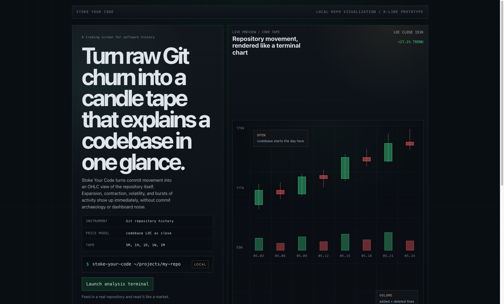
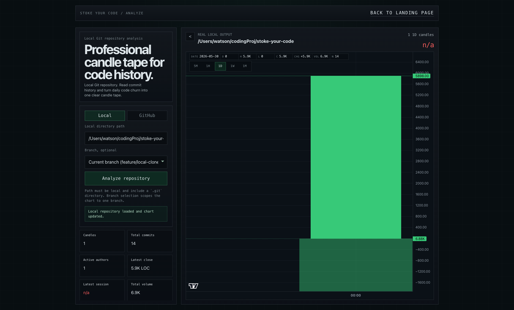

# Stoke Your Code

[English README](./README.md)

Stoke Your Code 是一个偏交易终端风格的 Git 历史可视化工具。它把代码仓库的变化转换成 K 线与成交量，让你像看市场走势图一样看懂一个项目的演化过程。

在线页面：[https://april-jk.github.io/stoke-your-code/](https://april-jk.github.io/stoke-your-code/)

当前支持：
- 本地 Git 仓库分析
- GitHub 仓库分析
- 本地与 GitHub 两种来源的分支下拉选择
- 多周期 K 线聚合：`5M`、`1H`、`1D`、`1W`、`1M`

## 截图

### 落地页



### 分析页



## 这个项目在做什么

相比直接看 commit 列表，Stoke Your Code 会把仓库历史转换成可直接阅读的图表语言：

- `Open / Close`：周期开始和结束时的代码存量
- `High / Low`：周期内代码量波动的极值
- `Volume`：新增 + 删除代码行数
- `Timeframes`：基于同一份 commit 事件流聚合成不同周期

它不是为了“像金融产品一样炫”，而是为了让软件历史变得一眼可读。

## 功能特性

- 偏作品展示的 landing page
- 偏交易终端感的分析页
- 本地 Git 仓库真实分析
- GitHub 仓库服务端 clone/fetch 后分析
- 本地与 GitHub 分支实时下拉选择
- 鼠标悬浮时显示 OHLC、涨跌、成交量、提交数
- 单屏分析布局
- 默认英文 README，同时附带中文文档

## 技术栈

- React 19
- TypeScript
- Vite
- Lightweight Charts
- Git CLI

## 本地运行

```bash
npm install
npm run dev
```

然后打开本地 Vite 地址，通常是 [http://localhost:5173](http://localhost:5173)。

## GitHub Pages

公开 Pages 站点是一个静态展示版本：

- 落地页可以完整在线访问
- 分析页会以 demo 模式展示示例仓库数据
- 真正的本地 Git 分析和实时 GitHub clone/fetch 分析仍然需要本地 dev server 或后端运行时支持

## 常用脚本

```bash
npm run dev
npm run build
npm run lint
npm run preview
```

## 分析流程

1. 校验本地路径或 GitHub 仓库地址
2. 解析分支选择
3. 从 Git 读取 commit 历史
4. 把 commit 事件转换成代码量变动
5. 聚合成所选周期的 K 线
6. 以终端风格图表展示 OHLC 与成交量

## 仓库说明

- 当前这条实现分支中，GitHub 仓库分析采用服务端 clone/fetch 到本地缓存
- 多周期 K 线现在基于真实 commit 事件流聚合，不再是从日线二次推导
- 如果仓库在单日内提交不频繁，`5M` 和 `1H` 视图出现稀疏分布是正常现象

## 相关文档

- 英文说明：[`README.md`](./README.md)
- 中文说明：`README.zh-CN.md`
- 产品上下文：[`PRODUCT.md`](./PRODUCT.md)
- 设计上下文：[`DESIGN.md`](./DESIGN.md)
- 最初想法记录：[`docs/idea.md`](./docs/idea.md)

## 当前状态

当前版本已经具备完整的演示能力：落地页可用于产品展示，分析页可用于真实仓库的 K 线查看，适合继续打磨、对外展示和推进产品化。
